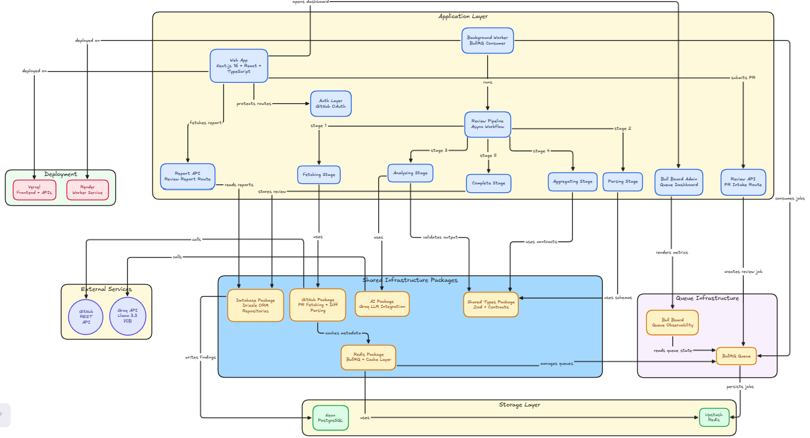
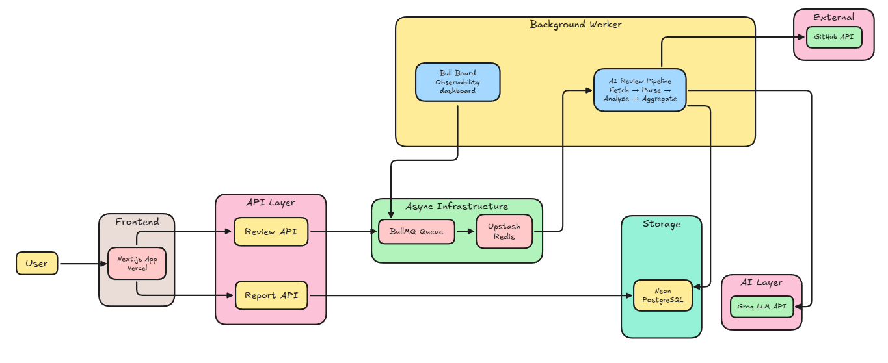
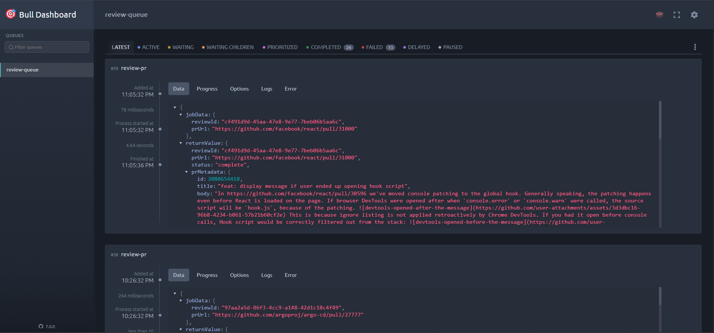

# GitReview AI

AI-powered GitHub Pull Request reviewer built with Next.js, BullMQ, Redis, Groq LLMs, and distributed worker infrastructure.

---

# Overview

GitReview AI automatically analyzes GitHub Pull Requests using an asynchronous AI pipeline.

The system fetches PR diffs, parses changed files, runs semantic code analysis using LLMs, aggregates findings, and generates structured review reports.

The architecture is intentionally designed like a production distributed system instead of a simple synchronous AI wrapper.

---

# Features

- AI-powered GitHub Pull Request analysis
- Asynchronous distributed review pipeline
- BullMQ + Redis queue architecture
- Background worker processing
- Real-time frontend polling
- Structured PR review reports
- Risk level scoring
- Semantic issue detection
- Queue observability with Bull Board
- Production deployment on Vercel + Render
- Persistent report storage with PostgreSQL

---

# Tech Stack

## Frontend

- Next.js 16
- React
- TypeScript
- Tailwind CSS
- React Hook Form
- Zod

## Backend / Infrastructure

- BullMQ
- Redis (Upstash)
- PostgreSQL (Neon)
- Drizzle ORM
- Express

## AI Layer

- Groq API
- LLM-powered semantic code analysis

## Deployment

- Vercel (Frontend + API)
- Render (Worker Service)

---

# System Architecture

## High-Level Architecture



---

## Internal Workflow Diagram



---

# High-Level Flow

```text
User submits GitHub PR
        ↓
Next.js API validates request
        ↓
Job added to BullMQ queue
        ↓
Redis persists queued job
        ↓
Worker service consumes job
        ↓
Pipeline stages execute
  • Fetching
  • Parsing
  • Analyzing
  • Aggregating
  • Complete
        ↓
Results stored in PostgreSQL
        ↓
Frontend polls status endpoint
        ↓
Review report rendered
```

---

# Pipeline Stages

## 1. Fetching Stage

The worker fetches:

- Pull Request metadata
- Changed files
- Git diffs
- Repository information

using the GitHub API.

---

## 2. Parsing Stage

The raw diff is cleaned and chunked into structured reviewable units.

This stage prepares code changes for semantic AI analysis.

---

## 3. Analyzing Stage

Each chunk is analyzed using Groq-hosted LLMs.

The AI model looks for:

- Bugs
- Security issues
- Performance problems
- Maintainability concerns
- Reliability risks

Each finding includes:

- Severity
- File path
- Line number
- Description
- Suggested fix

---

## 4. Aggregating Stage

AI findings are combined into:

- Final summary
- Risk level
- Metrics
- Structured findings list

---

## 5. Complete Stage

The review is stored in PostgreSQL and exposed through report APIs.

The frontend automatically redirects to the final report page after polling detects completion.

---

# Queue Infrastructure

GitReview AI uses BullMQ + Redis for asynchronous processing.

Benefits of this architecture:

- Non-blocking frontend UX
- Persistent jobs
- Retry handling
- Worker scalability
- Fault tolerance
- Distributed processing

Bull Board is integrated for queue observability.

Dashboard includes:

- Queue depth
- Active jobs
- Completed jobs
- Failed jobs
- Processing metrics

---

# Observability

The worker includes structured operational logs for:

- Stage execution
- Pipeline timing
- Slow review detection
- Queue processing visibility

Example structured log:

```json
{
  "event": "stage_completed",
  "stage": "analyzing",
  "reviewId": "abc123",
  "durationMs": 4210
}
```

---

# Local Development Setup

## 1. Clone Repository

```bash
git clone https://github.com/aakash811/GitReview.git
cd GitReview
```

---

## 2. Install Dependencies

```bash
pnpm install
```

---

## 3. Configure Environment Variables

Create:

```text
.env
```

Required variables:

```env
AUTH_SECRET=
AUTH_GITHUB_ID=
AUTH_GITHUB_SECRET=
DATABASE_URL=
REDIS_URL=
UPSTASH_REDIS_REST_URL=
UPSTASH_REDIS_REST_TOKEN=
GROQ_API_KEY=
GITHUB_TOKEN=
NEXT_PUBLIC_APP_URL=
```

---

## 4. Run Database Migrations

```bash
pnpm db:push
```

---

## 5. Start Development Servers

```bash
pnpm dev
```

Services:

- Frontend → http://localhost:3000
- Worker → http://localhost:3001
- Bull Board → http://localhost:3000/admin/queues

---

# Deployment Architecture

## Frontend + API

Hosted on Vercel.

Responsibilities:

- UI rendering
- API routes
- Authentication
- Queue job creation
- Status polling

---

## Worker Service

Hosted on Render.

Responsibilities:

- Queue consumption
- AI analysis
- Pipeline execution
- Bull Board dashboard
- Worker health monitoring

---

# Example Review Output

Example findings generated by the system:

- Potential null pointer exception
- Unsafe array access
- Performance bottlenecks
- Missing validation
- Maintainability concerns

Each finding contains:

- Severity
- File path
- Line number
- Explanation
- Suggested fix

---

# Screenshots

## BullMQ Queue Dashboard



This dashboard provides operational visibility into:

- Queue depth
- Active jobs
- Failed jobs
- Completed jobs
- Processing throughput
- Worker health

It demonstrates the distributed asynchronous infrastructure powering the review pipeline.

---

# Future Improvements

- Multi-model AI evaluation
- GitHub OAuth private repo support
- Inline PR comments
- Vector-based code retrieval
- Incremental PR reviews
- Streaming AI analysis
- Team dashboards
- Webhook-triggered reviews

---

# Why This Project Matters

Most AI projects stop at synchronous chat interfaces.

GitReview AI focuses on:

- Distributed systems
- Background processing
- Queue-based architectures
- Production observability
- Infrastructure design
- AI-driven semantic code review

The goal was to build a production-style engineering system rather than a simple AI demo.

---

# Author

Aakash Borse

GitHub:
https://github.com/aakash811
